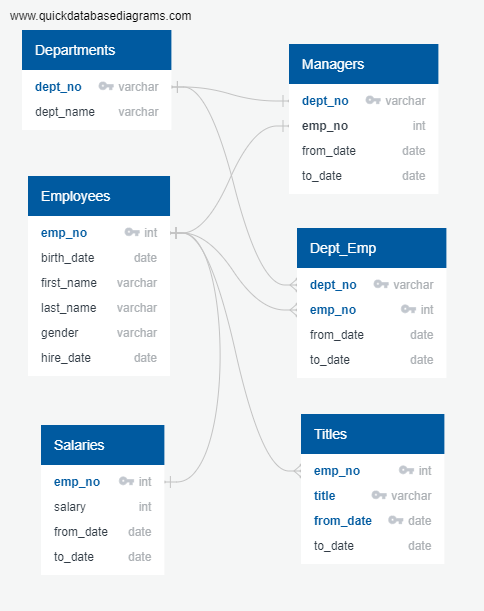

# Pewlett-Hackard-Analysis

## Challenge Overview
Given additional assignments to: determine the total number of employees per title who will be retiring, and to identify  employees who are eligible to participate in a mentorship program. 

## Challenge Summary

### Deliverable(s):
 - CSV(s): retirement_ready.csv, expected_vacancies.csv, mentorship_elegibility.csv
 - DB Table(s): retirement_ready, expected_vacancies, mentorship_elegibility
 - Query File(s): schema.sql, queries.sql, challenge_queries.sql

#### Technical Report: 

#### Entity Relationship Diagram (ERD) for Pewlett Hackard's Database
 

The above diagram displays how the database for Pewlett Hackard was mapped out according to the inital provided spreadsheets from the company. Each titled list is a different table within the database that was created from each spreadsheet and aids when creating schema for database tables. Datatypes are assigned accordingly to each item within the lists. In addition, Primary and Foreign Keys are marked in order to establish the relationships between tables based on the items each contain and to aid when performing queries within the database. 

#### Summary of Results:
 - Total Number of Individuals Retiring: 33,118 
    - Full List: [retirement_ready.csv](Data/retirement_ready.csv)
 - Total Number of Individuals Retiring by Title: 
    - Reference: [expected_vacancies.csv](Data/expected_vacancies.csv)
 
 Title | Count
 --- | --- 
 Assistant Engineer | 251
 Engineer | 2711
 Manager | 2
 Senior Engineer | 13651
 Senior Staff | 12872
 Staff | 2022
 Technique Leader | 1609
 
  - Number of Individuals Available for Mentorship Role: 1,549
     - Full List: [mentorship_elegibility.csv](Data/mentorship_eligibility.csv)
  
 #### Retrieval Process:
 The problems given were the following:
  - Identify the number of employees that are eligible for retirement and determine the number of positions that would need to be filled by those titles. 
  - Determine the number of current employees that would qualify to enter a mentorship role to assist in training new employees. 
  
The process taken to determine the number of employees retiring and positions to be filled were derived creating multiple tables using queries. The required information was pulled from the following database tables:
 - Current Employment (current_emp): Employee Number (emp_no), First Name (first_name), & Last Name (last_name)
 - Titles (titles): Employee Title (title), Title Start Date (from_date)
 - Salaries (salaries): Salary (salary)

After completing this initial pull of information into a table (retirement_sort), it was noticed that within the table there were duplicates of employee records due to employees having title changes from promotions. The another table (retirement_ready) was created with an applied partition query in order to select the employee records with the most current job title. A count query was performed on this table based on Employee Number (emp_no) values and determined the total amount of retiring employees to be 33,118. The complete list of retiring employees can be viewed within the following created spreadsheet: [retirement_ready.csv](Data/retirement_ready.csv). 
After, the table was then grouped by title within a query in order to assess the number of titles that would be vacant from employee retirement. The complete list of expected vacancies can be viewed within the following created spreadsheet: [expected_vacancies.csv](Data/expected_vacancies.csv). 

To address the problem of the large amount of vacancies created by retirement, a list of qualifying employees to enter a mentorship role is created. The criteria was given that in order for eligible to participate in the mentorship program, employees will need to have a date of birth that falls between January 1, 1965 and December 31, 1965. The required information was pulled from the following database tables: 
 - Employees (employees): Employee Number (emp_no), First Name (first_name), Last Name (last_name), & Birth Date (birth_date)
 - Titles (title): Employee Title (title)
 - Department Employee (dept_emp): Department Start Date (from_date), Department Current Date (to_date)
 
This information was also filtered by the Department Current Date in order to determine currently employed employees within the company, and filtered by birth dates with the year 1965 before being saved into a table (emp_birth_sort). Duplicates were also within the table due to employees having changed job titles, and these were removed by another partition query to filter the selection by current job title for the employee. This resulted in a final count of mentorship eligibility of 1,549 employees. The complete list of eligible mentorship employees can be viewed within the following created spreadsheet: [mentorship_eligibility.csv](Data/mentorship_eligibility.csv). 

#### Recommendation for Further Analysis:
Based on the results of each request, the amount of retiring employees is much higher than the amount of available eligible employees towards the mentorship program. Further analysis should be done to determine if the birth date range should be extended in order to allow more mentors to be available as older employees retire. In addition, the available mentorships list would benefit being sorted by number of titles in order to anticipate what resources are available, and which areas would need more mentors to train future employees. 
